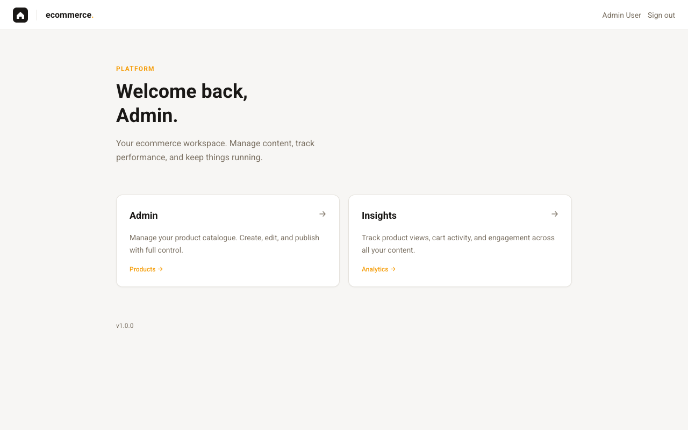
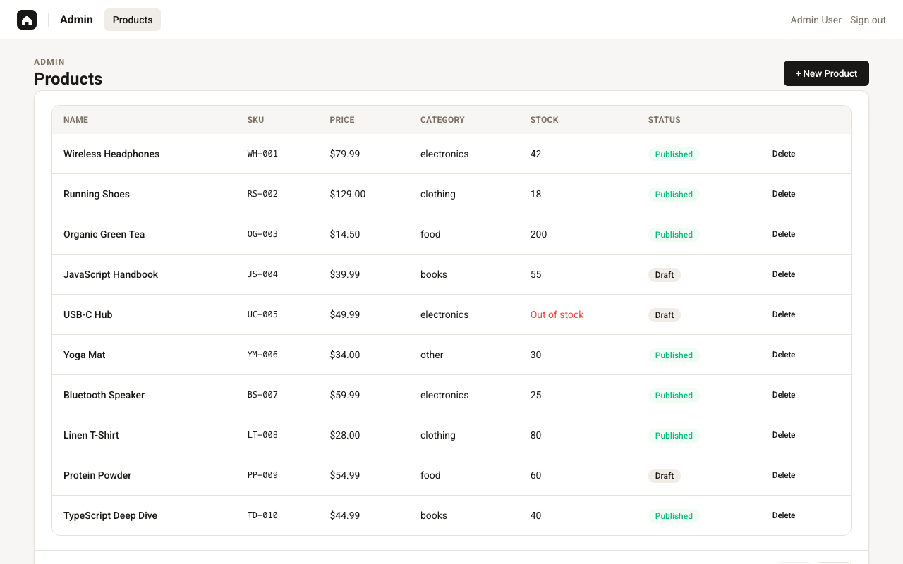
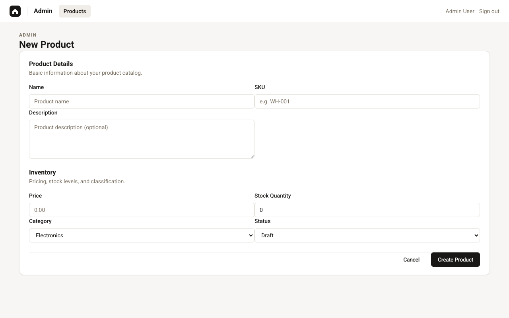
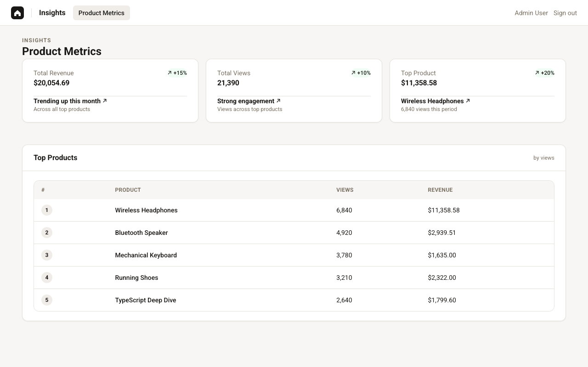

# 🚀 Modern Module Federation Monorepo

A scalable, production-grade micro-frontend architecture built with **React 19**, **Module Federation 2.0**, and **Rspack**. This project serves as a technical showcase for runtime application composition where multiple independently deployable modules share a unified design system, state, and global UI components.

---

## 🚀 Overview

This project implements a sophisticated **Micro-Frontend (MFE)** pattern using a Shell-based composition. It breaks down a monolithic structure into a **Single Shell (Host)** and multiple independently deployable feature **Remotes**:

- **🏢 Single Shell (Host):** Acts as the centralized container, providing global routing, authentication, and the shared UI layout.
- **📊 Two Distinct Dashboards:**
  - **Posts/Admin Remote:** A dedicated micro-frontend for managing content creation and data inventory.
  - **Insights Remote:** A dedicated analytics micro-frontend displaying performance metrics and charts.
- **📈 Scale Independently:** Feature teams can deploy updates to the Posts or Insights dashboards without redeploying the `host` shell.
- **🤝 Shared Design System:** Ensures visual parity across all apps with a centralized `@repo/ui` library.

---

## 📸 Screenshots

<table width="100%">
  <tr>
    <td width="50%">
      
      <p align="center"><b>Admin Host</b></p>
    </td>
    <td width="50%">
      
      <p align="center"><b>Product Catalog</b></p>
    </td>
  </tr>
  <tr>
    <td width="50%">
      
      <p align="center"><b>Admin: Create Product</b></p>
    </td>
    <td width="50%">
      
      <p align="center"><b>Performance Insights</b></p>
    </td>
  </tr>
</table>

---


## 🔑 Key Benefits of Module Federation

This architecture provides several production-grade advantages over traditional micro-frontend approaches like iframes or separate SPAs:

- **📦 Efficient Resource Sharing:** Shared libraries (React, React Router, etc.) are fetched **only once**. The Host provides these as singletons, ensuring remotes don't re-download core JS, drastically reducing the Initial Page Load (FCP).
- **☁️ Simplified Infrastructure:** Unlike traditional micro-frontends which often require complex reverse proxies or separate S3 buckets for each app, Module Federation entries can be co-located or served from a unified origin, simplifying the CI/CD pipeline and SSL management.
- **🚢 Independent Versioned Deployment:** Deployments are managed at the module level. You can update a feature remote (e.g., `admin`) and it will be immediately available to the Host shell without requiring a re-deployment or build of the Shell itself.
- **🚀 Sub-second HMR (Developer Experience):** By decoupling the build process into smaller modules and using **Rspack**, developers experience near-instant Hot Module Replacement, even as the overall system grows to hundreds of thousands of lines of code.
- **🧩 Seamless Context Sharing (No Iframes):** Since all remotes run in the same browser context (unlike iframes), they share the same window object, allowing for unified modals, nested routing, and shared global state without the overhead of `postMessage` communication.
- **🛡️ Fault Tolerance & Isolation:** Individual feature remotes are wrapped in **Error Boundaries** within the Host. If a specific micro-frontend crashes due to a runtime error, the Shell remains operational, allowing the user to continue using other parts of the platform.

---

## 🛠️ Core Tech Stack

This project leverages a curated selection of industry-leading tools for a high-performance developer experience:

- **[React 19](https://react.dev)** — The latest features of the React ecosystem.
- **[Rspack](https://rspack.dev)** — High-performance Rust-based bundler for sub-second rebuilds.
- **[Module Federation 2.0](https://module-federation.io)** — The industry standard for micro-frontends.
- **[NX](https://nx.dev)** — Modern monorepo task runner and workspace orchestrator.
- **[Tailwind CSS](https://tailwindcss.com)** — Utility-first styling for a consistent design system.
- **[Zustand](https://github.com/pmndrs/zustand)** — Lightweight, performant state management.

---

## ✨ Recommended UI Ecosystem (2025/2026)

Built using the "Best-in-Class" libraries for a production-grade application:

- **[React Hook Form](https://react-hook-form.com/)** — High-performance forms with integrated validation.
- **[Yup](https://github.com/jquense/yup)** — Robust schema-driven validation.
- **[Lucide Icons](https://lucide.dev)** — Clean and consistent iconography.
- **[Classnames](https://github.com/JedWatson/classnames)** — Simple utility for conditional CSS joining.

---

## 🔌 Federation Interface

This project utilizes **Module Federation 2.0** for dynamic runtime composition of the micro-frontend ecosystem. Below is the breakdown of the roles and exposed interfaces:

### 🏛️ The Host Shell (`:4200`)

The Host application serves as the system's entry point and orchestrator.

- **Routing Authority:** Owns the primary navigation and lazy-loads feature modules based on the window.location.
- **Dependency Authority:** Provides the singleton instances of core libraries (`react`, `react-router-dom`) to ensure consistent state across the entire tree.
- **Context Provider:** Exposes the `AuthProvider` and `AppHeader` to all feature remotes, acting as the Single Source of Truth for authentication and visual shell consistency.

### 🧩 Feature Remotes (`:4201`, `:4202`)

The Remotes (`admin` and `insights`) are standalone SPAs that can be developed in isolation but are composed into the Host at runtime.

- **Atomic Deployment:** Features can be updated and deployed without requiring a build of the Shell.
- **Shared UI Consumer:** Every remote pulls the `@repo/ui` library from the monorepo workspace for design consistency.
- **Shell Awareness:** Through the `host/AppHeader`, remotes automatically integrate into the global navigation without manually re-implementing headers.

### 📡 Exposed Modules API

| Provider     | Path              | Technical Purpose                                                                                  |
| :----------- | :---------------- | :------------------------------------------------------------------------------------------------- |
| **Host**     | `./AuthProvider`  | Shared **Zustand** store containing the user session and login/logout actions.                     |
| **Host**     | `./AppHeader`     | A standardized, slot-based UI shell that remotes use to build their own navigation sub-structures. |
| **Admin**    | `./AdminShell`    | The complete Administrative package, including product management and inventory screens.           |
| **Insights** | `./InsightsShell` | The Analytics package, providing self-contained data fetching logic and stat visualizations.       |

### Application Routes

| Context        | Base Path     | Source     | Description                               |
| :------------- | :------------ | :--------- | :---------------------------------------- |
| **Gateway**    | `/login`      | Host       | Public authentication entry point.        |
| **Dashboard**  | `/`           | Host       | Central navigation hub.                   |
| **Management** | `/admin/*`    | `admin`    | Product catalog and inventory management. |
| **Analytics**  | `/insights/*` | `insights` | Real-time performance metrics and charts. |

---

## 🏗️ Architecture Principles

- **Atomic Design:** UI components in `@repo/ui` are structured into modular, reusable units.
- **Strict TypeScript:** 100% type safety is enforced to ensure maintainability and eliminate runtime errors.
- **No Magic Numbers:** All design tokens (colors, spacing, shadows) are centralized in `tailwind.config.js`.
- **Isolated Failures:** Remotes are wrapped in `<Suspense>` and `<ErrorBoundary>` to ensure the host shell remains operational even if a micro-frontend fails.

---

## ⚙️ Development

Ensure you have [Node.js](https://nodejs.org/) v20+ installed.

```bash
# 1. Install dependencies
npm install

# 2. Launch all services simultaneously
npm run serve:host     # http://localhost:4200
npm run serve:admin    # http://localhost:4201
npm run serve:insights # http://localhost:4202

# 3. Build for production
npm run build
```

---

