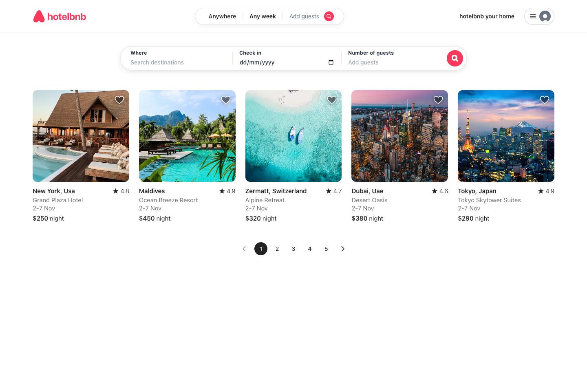
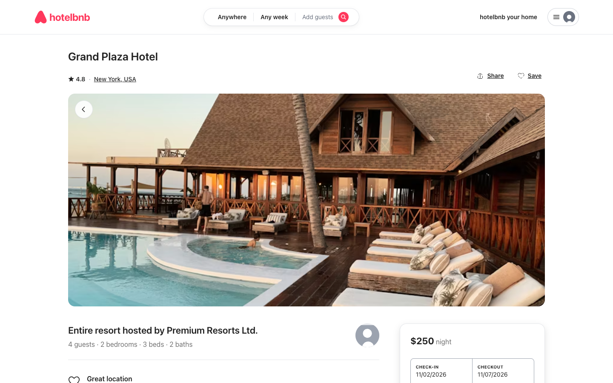
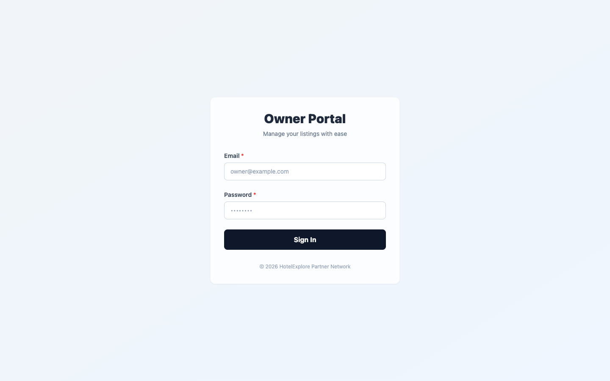
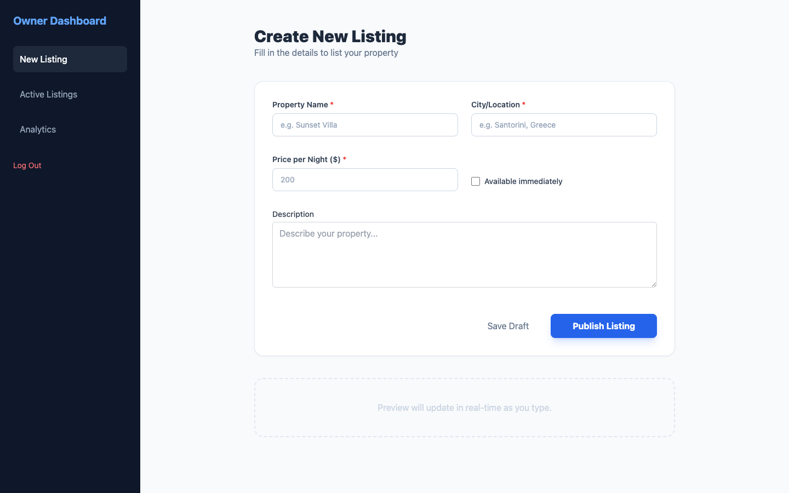

# React Monorepo

A monorepo built with **Nx** containing two React applications and a shared component library. This setup demonstrates how multiple apps can share UI components and utilities without duplicating code.

---

## Structure

```
Monorepo/
├── apps/
│   ├── hotel-exploration/     # Airbnb-style hotel listing app
│   └── admin-dashboard/       # Owner/admin portal
└── packages/
    └── common/                # Shared components and utilities
```

### `apps/`

Each app is an independent React application built with Vite. They are completely separate — different routing, different pages, different purpose — but they pull from the same shared library.

| App | Description |
|-----|-------------|
| `hotel-exploration` | Browse and view hotels. Has a listing page with search and pagination, and a detail page with a booking widget. |
| `admin-dashboard` | Owner portal to create and manage property listings. Login and dashboard pages. |

### `packages/common`

A shared library imported by both apps as `@local/common`. It exports:

**Components**
- `TextInput` — labelled text field with error state
- `Checkbox` — accessible checkbox with label
- `Card` — clickable card container
- `Pagination` — page navigation control
- `Popover` — click-away overlay with trigger

**Utilities**
- `cn` — merges Tailwind class names safely (clsx + tailwind-merge)
- `titleCase`, `slugify` — string helpers
- `formatDate` — date formatting
- `unique`, `chunk` — array helpers

---

## How the Build Works

Nx manages the build order so that `packages/common` is always compiled before the apps that depend on it.

```
packages/common  →  apps/hotel-exploration
                 →  apps/admin-dashboard
```

When you run a build command, Nx:
1. Detects that both apps declare `common` as a dependency
2. Builds `common` first (outputs to `packages/common/dist/`)
3. Then builds each app, which imports from that compiled output

**Build all projects:**
```sh
npx nx run-many -t build
```

**Build a single app** (Nx automatically builds `common` first):
```sh
npx nx build hotel-exploration
npx nx build admin-dashboard
```

**Run dev server:**
```sh
npx nx serve hotel-exploration
npx nx serve admin-dashboard
```

**Visualise the dependency graph:**
```sh
npx nx graph
```

---

## Screenshots

### Hotel Exploration App

**Listing Page**



**Hotel Detail Page**



---

### Admin Dashboard

**Login Page**



**Dashboard — Create Listing**



---

## Tech Stack

| Tool | Role |
|------|------|
| [Nx](https://nx.dev) | Monorepo tooling, task orchestration, build caching |
| React 19 | UI framework |
| TypeScript | Type safety across all packages and apps |
| Vite | Dev server and bundler |
| Tailwind CSS | Styling |
| React Router | Client-side routing (hotel-exploration) |

---

## Getting Started

```sh
# Install dependencies
npm install

# Run both apps (separate terminals)
npx nx serve hotel-exploration
npx nx serve admin-dashboard

# Build everything
npx nx run-many -t build
```
